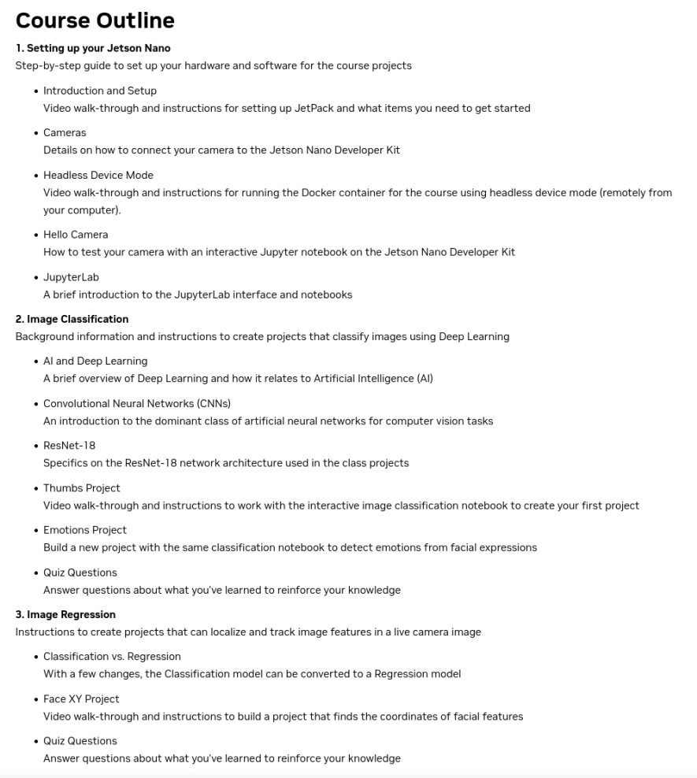
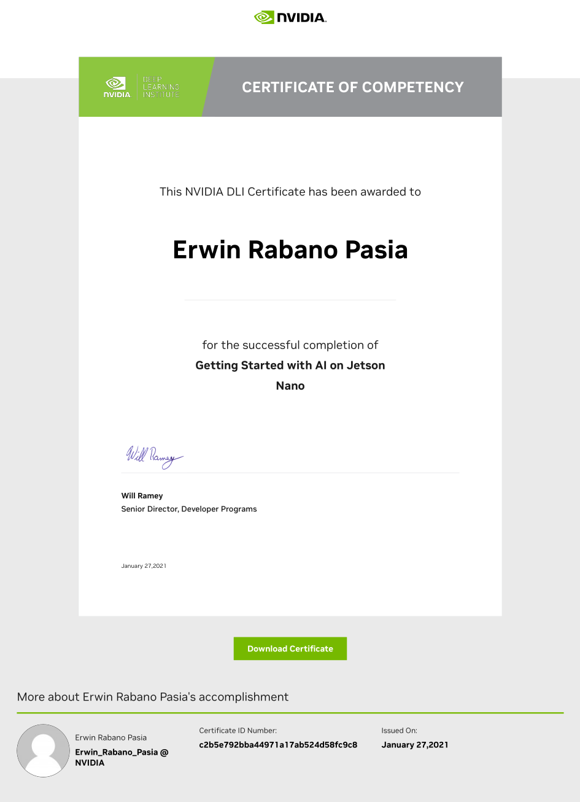

# [NVIDIA DLI - Advanced Technical Workshop: Getting Started in AI with Jetson (Edge AI)](https://learn.nvidia.com/courses/course-detail?course_id=course-v1:DLI+C-RX-02+V2) - COMPLETED!

This repository provides an overview of the **"Getting Started in AI with Jetson (Edge AI)"** course from NVIDIA. The course introduces learners to the fundamentals of developing AI models using the NVIDIA Jetson Nano, a powerful platform for edge computing.

## Learning Objectives

By the end of this course, you will be able to:

- **Set up the NVIDIA Jetson Nano and camera**: Configure both hardware and software components, including connecting peripherals such as cameras, to prepare the Jetson Nano for AI tasks.
  
- **Collect image data for classification models**: Capture and preprocess images to ensure they are suitable for training deep learning models.
  
- **Annotate image data for regression models**: Learn how to annotate data for regression tasks where the goal is predicting continuous values (e.g., coordinates).
  
- **Train a neural network on your data**: Using frameworks like PyTorch, train neural networks on your collected data, including understanding architectures like Convolutional Neural Networks (CNNs) and specific models like ResNet-18.
  
- **Run inference on Jetson Nano**: Deploy trained models on the Jetson Nano to perform real-time inference, leveraging its GPU capabilities for edge AI applications.

## Course Outline

### 1. Setting up your Jetson Nano

This section provides a comprehensive guide to setting up both hardware and software required for the course projects.

- **Introduction and Setup**: Set up the Jetson Nano Developer Kit with NVIDIA’s JetPack SDK. Install necessary software libraries and configure the environment.
  
- **Cameras**: Connect a camera (e.g., USB or Raspberry Pi Camera Module) to your Jetson Nano for capturing images.
  
- **Headless Device Mode**: Set up the Jetson Nano in headless mode, allowing remote access via SSH or VNC without a dedicated monitor or keyboard.
  
- **Hello Camera**: Test your camera setup using an interactive Jupyter notebook to ensure proper configuration.
  
- **JupyterLab**: Get familiar with JupyterLab, an interactive environment used throughout the course for running code and visualizing results.

### 2. Image Classification

Dive into deep learning concepts and apply them to image classification tasks.

- **AI and Deep Learning Overview**: Understand how deep learning fits within artificial intelligence (AI), focusing on neural networks and their role in image classification.
  
- **Convolutional Neural Networks (CNNs)**: Learn about CNNs, which are widely used in computer vision applications, and how they process image data through convolutional layers.
  
- **ResNet-18 Architecture**: Explore ResNet-18, a popular CNN architecture known for its simplicity and effectiveness in image classification tasks.
  
- **Thumbs Project**: Build an interactive image classification model that distinguishes between thumbs-up and thumbs-down gestures using a pre-trained ResNet-18 model fine-tuned on your dataset.
  
- **Emotions Project**: Classify facial expressions into different emotional categories (e.g., happy, sad) using deep learning techniques.

### 3. Image Regression

This section focuses on regression tasks where you predict continuous values from images.

- **Classification vs. Regression**: Understand the difference between classification (discrete labels) and regression (continuous values).
  
- **Face XY Project**: Modify an existing classification model into a regression model that detects specific points on a face (e.g., eyes or nose) in real-time video streams.

## Tools and Frameworks

The following tools are used throughout the course:

1. **NVIDIA Jetson Nano**: A compact edge AI device with GPU acceleration that enables efficient inference at low power consumption.
2. **PyTorch**: A popular deep learning framework used for building, training, and deploying neural networks.
3. **JupyterLab**: An interactive development environment that allows you to write code in Python while visualizing results directly within notebooks.
4. **JetPack SDK**: NVIDIA’s software development kit that includes libraries like CUDA and cuDNN optimized for running AI workloads on Jetson devices.

## Conclusion

By completing this course, you'll gain practical experience in:

- Setting up hardware (Jetson Nano)
- Collecting and annotating data
- Training deep learning models (classification and regression)
- Running real-time inference on edge devices

The hands-on projects such as "Thumbs" and "Face XY" ensure that you not only understand theoretical concepts but also apply them in real-world scenarios using powerful tools like PyTorch on NVIDIA's Jetson platform.

## Instructor-Led Workshop Outline:

    

## [Certificate Of Competency:](https://learn.nvidia.com/certificates?id=c2b5e792bba44971a17ab524d58fc9c8&trk)

    

